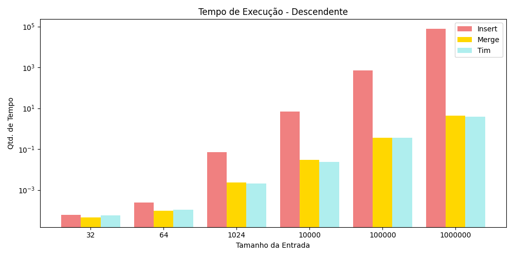
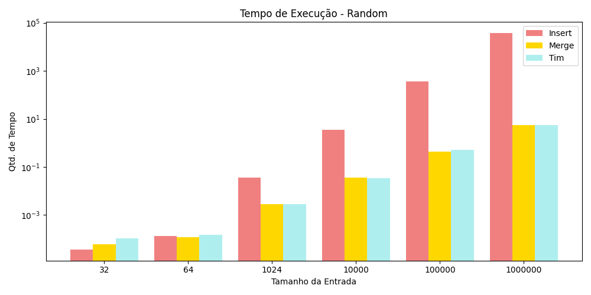
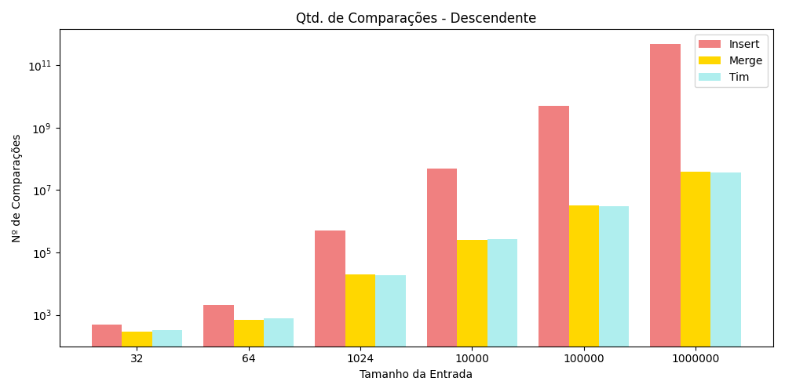
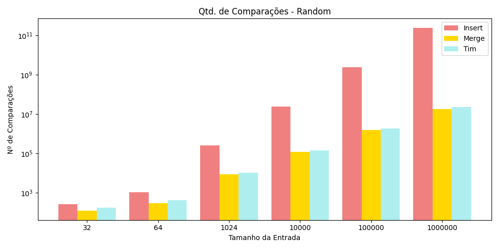

<h1 style="text-align:center">Análise de Métodos de Ordenação</h1>

Bárbara Boechat 
Projeto e Análise de Algoritmos   Universidade Federal de São João del-Rei 

## 1. Introdução 

Neste trabalho serão realizadas comparações de desempenho entre os algoritmos
`MergeSort`, `InsertionSort` e `TimSort` considerando o tempo e o número de
comparações feitas para ordenar completamente os vetores.

## 2. Especificações

### 2.1 Organização das Entradas:

Toma um vetor aleatório como entrada e o ordena, em seguida este deve servir de
entrada como vetor ordenado acedente e descendente após ser invertido. 
10 arquivos por pasta. 

    ─┬─ "Entradas"
    └─┬─ "Dir": Num. Aleatorios  
    ├─── 32 Núm.
    ├─── 64 Núm.
    ├─── 1024 Núm.
    ├─── 10K Núm.
    ├─── 100K Núm.
    └─── 1M Núm.

## 3. InsertionSort

O `InsertionSort` consiste em ordenar os itens inserindo-os na posição
corresponde da lista, nessa estratégia um valor ‘chave’ é comparado com os
outros itens até que a posição correta seja encontrada. Essa comparação é feita
em direção à esquerda, comparando a ‘chave’ e o antecessor.

Se o ‘item’ comparado for menor, a lista deve ser deslocada para a direita,
visando “abrir” um novo espaço para colocar a ‘chave’ na posição
correspondente; finalmente ao encontrar um ‘item’ maior ou não haver mais itens,
significa que foi encontrada a posição que este ‘item’ deve estar, ele ser
posicionado corretamente na posição correspondente.

### 3.1 Complexidade 

o Insert é mais rápido e eficiente quando utilizado para ordenar listas pequenas,
 em que o número de comparações é menor.

#### 3.1.1 Melhor Caso:

O melhor caso é uma lista já ordenada, pois assim apenas é necessário percorrer
a lista `n — 1` vezes, ou seja, todos os seus elementos exceto o primeiro. Neste
caso, a ordem de complexidade é `O(n)`.

#### 3.1.2 Caso Médio: 
Este caso é uma média entre todas as entradas possíveis. Sendo assim, a ordem
de complexidade é `O(n²)`.

#### 3.1.3 Pior Caso:

O pior caso ocorre quando os elementos da lista estão em ordem decrescente,
pois o laço interno realizará a quantidade máxima de iterações, de forma que a
‘chave’ sempre será menor o antecessor. Neste caso, a ordem de
complexidade é `O(n²)`.

## 4. MergeSort

`MergeSort` é um algoritmo que utiliza do ideal “dividir e conquistar”, assim,
ele recursivamente dissolve o problema em subproblemas, até que eles se tornem
simples o suficiente para serem resolvidos diretamente. As soluções dos
subproblemas são então combinadas de modo a gerar a solução do problema original.
De forma geral, o algoritmo divide a lista em partes iguais, as ordena e as
recombina de forma ordenada para gerar a solução de fato.
 

### Complexidade 

O Merge é mais rápido e eficiente quando utilizado para ordenar listas grandes 
ou grandes quantidades de dados. Este algoritmo o `Melhor Caso`, `Caso Médio` e
`Pior Caso` iguais, pois ao realizar as três etapas que contribuem para o cálculo 
da complexidade: dividir `O(1)`, conquistar `2T(n/2)` e combinar `Θ(n)`, assim a 
ordem de complexidade para todos os casos é `O(nlog2n)`.
    

## 5. TimSort
### 5.1 Complexidade

#### 5.1.1 Melhor Caso:
    equação melhor caso?

#### 5.1.2 Caso Médio: 
    equação medio caso?

#### 5.1.3 Pior Caso:
    equação pior caso?

Ao analisar a complexidade dos algoritmos citados acima, é possível reuni-las
na tabela a seguir: 

| Algoritmo     | Melhor Caso   |  Médio Caso   | Pior Caso   |
| ------------- |:-------------:|:-------------:|:-----------:|
| InsertionSort | right-aligned | $1600         |             |
| MergeSort     | centered      |   $12         |             |
| TimSort       | are neat      |    $1         |             |

## 6. Análises do Tempo
     

  

  

  

## 7. Análises das Comparações

  

 

  

  

